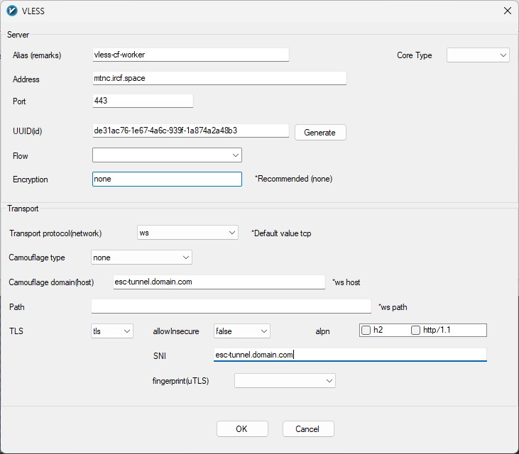

<h1>VLESS CF Worker</h1>

Configuration for VLESS tunnel on Cloudflare Worker

Also, you can <a href='https://note.al1almasi.ir/easy-vless-config-with-cf-worker/'>read this in my personal notebook</a>.

نسخه‌ی فارسی این نوشته: <a href='https://fa.note.al1almasi.ir/easy-vless-config-with-cf-worker/'>اینجا کلیک کنید</a>.

<h2>How to use this?</h2>

It's Super easy (you don't need any server). Just create a CF Worker and then copy & paste all of the <a href="https://raw.githubusercontent.com/AliAlmasi/vless-cf-worker/main/worker.js">worker.js file's content</a> as the worker's configuration, then do all of these things:

<ol>
  <li>Generate a UUID and replace the one in the worker's configuration after you paste it (<a href="https://github.com/AliAlmasi/vless-cf-worker/blob/main/worker.js#L201">line 201</a>).</li>
  <li>Save & Deploy.</li>
  <li>OPTIONAL: If you've got a domain on your Cloudflare, add a custom domain for your worker.</li>
  <li>Create a VLESS configuration on any V2Ray/Xray program that you use (personally, I prefer <a href="https://github.com/2dust/v2rayN">v2rayN</a>)</li>
  <li>Set TLS as <b>TLS</b> and your worker's domain as the SNI.</li>
  <li>Set transport to <b>ws</b>.</li>
  <li>Set your worker's domain as the ws host.</li>
  <li>Set any <i>Clean Cloudflare IP</i> as the destination address. You may use <s><a href="https://ircf.space/">IRCF.space</a></s> <code>engage.cloudflareclient.com</code> as the destination address.</li>
  <li>Set <b>443</b> as port.</li>
  <li>And finally, set your own generated UUID as the configuration's UUID.</li>
</ol>

Now you're all done. Test your VLESS configuration.

Read more on <a href='https://note.al1almasi.ir'>note.al1almasi.ir</a>

